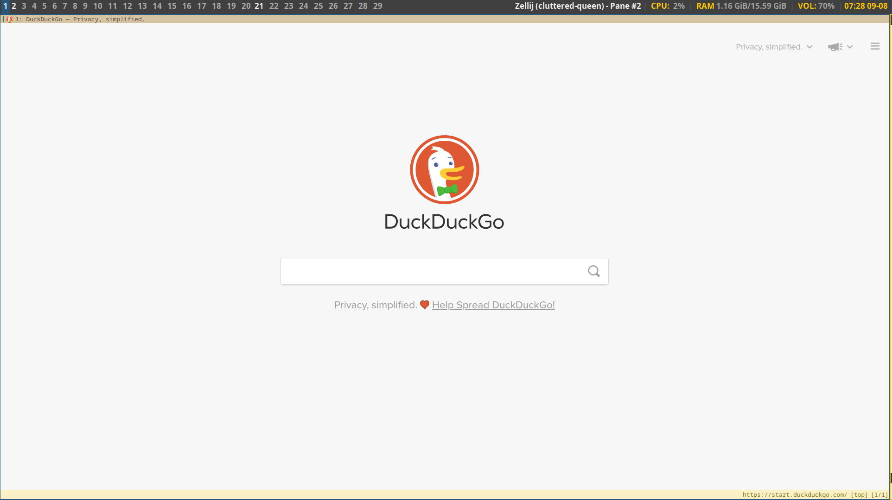
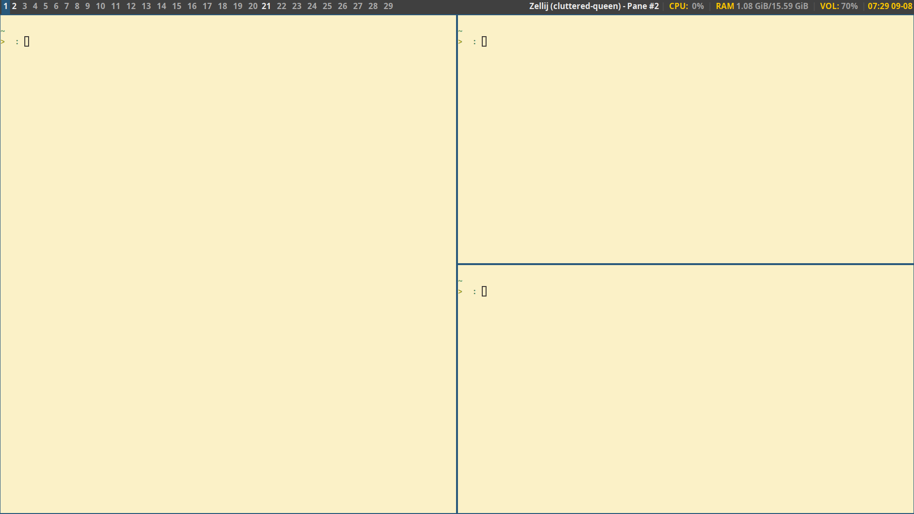
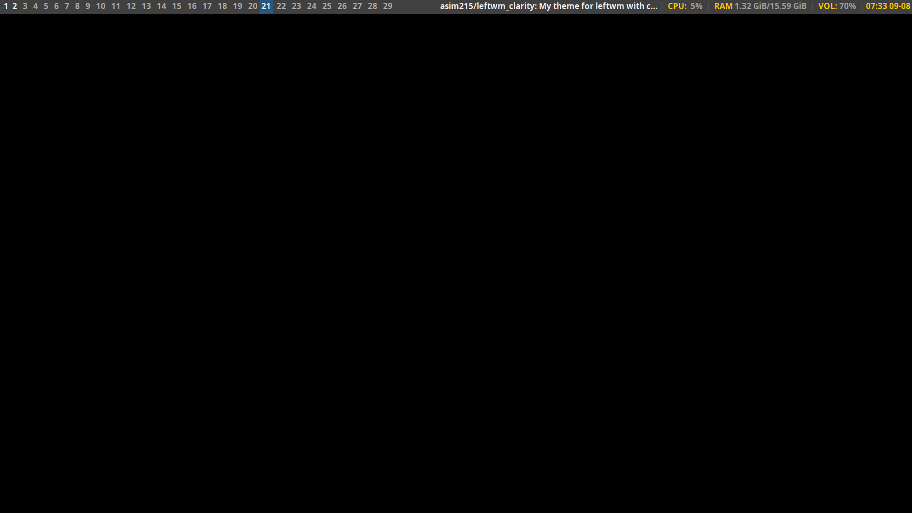

# Clarity - theme for leftwm
Theme for leftwm based on LateNight [LateNight](https://github.com/JacoMalan1/LateNight)

It have following features:
- config.ron have necessary settings for leftwm
- Tags are from 1 to 19
- No background image (can be turn on in `up` by using feh)
- No space between windows, only borders highlighted on focus

## Screenshots






## Installation
 1. Clone the repository.
 2. Put clarity directory into themes of `~/.config/leftwm/themes/`
 3. Replace `~/.config/leftwm/config.ron` with `config.ron`. 
    Also you can make backup you your current config. 
 2. Create soft link to the theme with force option to replace existing:
    ```ln -fs ~/.config/leftwm/themes/clarity ~/.config/leftwm/themes/current```
 3. Make SoftReload of leftwm config or relogin/reboot.

## Keys
All descriptions in the `config.ron`

 - `Win/Meta + 1-9` to switch to tag <1-9>
 - `Alt + 0-9` to switch to tag <10-19>

## Dependencies
 - leftwm
 - feh
 - polybar
 - dunst
 - rofi
 - [rofi-power-menu](https://github.com/jluttine/rofi-power-menu)
 - i3lock
 - alacritty
 - zellij
 - bottom
