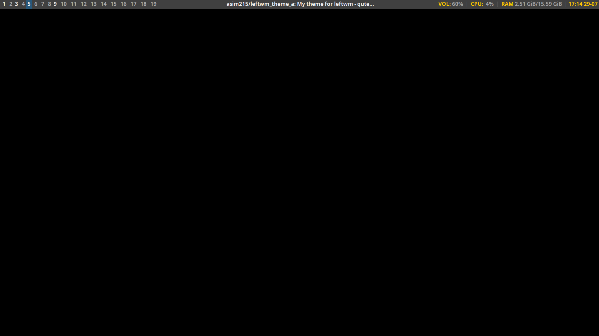
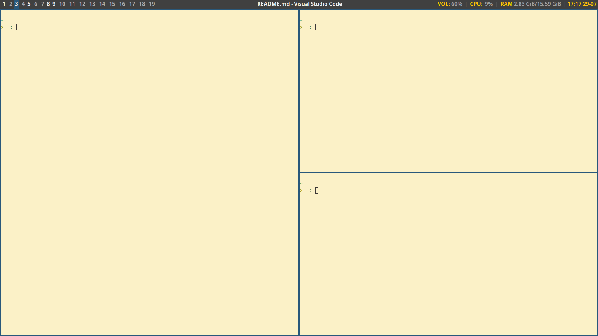

# Theme for leftwm - Clarity
My theme for leftwm based on LateNight [LateNight](https://github.com/JacoMalan1/LateNight)

It have following features:
- config.ron have necessary settings for leftwm
- Tags are from 1 to 19
  - Win/Meta + 1-9 (1 - 9)
  - Alt + 0-9 (10 - 19)
- No background image (can be turn on in `up` by using feh)
- No space between windows, only borders highlighted on focus

## Screenshots

## Dependencies
 - leftwm
 - feh
 - polybar
 - dunst
 - rofi
 - i3lock
 - alacritty
